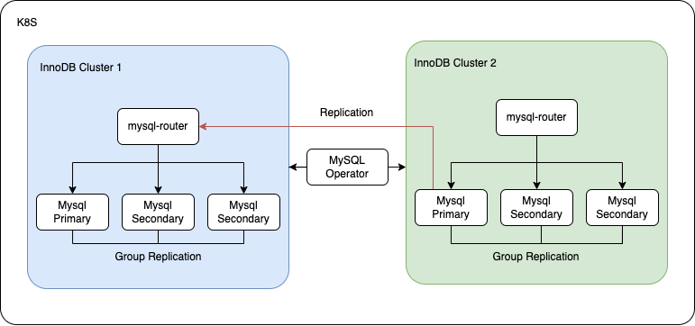

# Innodbcluster DR #
이번 테스트는 k8s에서 mysql-operator를 사용하여 innodbcluster를 구성 후 기 구성된 inodbcluster에 대해서 추가적인 innodbcluster를 구성해서 DR 구조를 구성하는 테스트 입니다.


# *테스트만 진행된 경우로 실제 환경에서 사용할려면 많은 테스트가 필요함을 명시합니다.* #

mysql-operator 및 innodbcluster는 mysql에서 공식적으로 지원하는 Manifest Files를 이용하여 설치 합니다.

테스트 환경으로 1개의 k8s cluster에서 진행을 하지만, 2개의 k8s Cluster 구조에도 적용할 수 있게 Service IP를 사용하여 Replication을 진행합니다.

## 테스트 구성도 ##



---

## Deploy MySQL Operator ##

manifest 자료는 files에 있지만 공식 사이트 가이드에 나오는 방식으로 진행하도록 하겠습니다.

### Deploy MySQL CRD ###

Custom Resources Definition(CRD)를 배포하겠습니다.

`kubectl apply -f kubectl apply -f https://raw.githubusercontent.com/mysql/mysql-operator/trunk/deploy/deploy-crds.yaml`

```
// Output is similar to:
customresourcedefinition.apiextensions.k8s.io/innodbclusters.mysql.oracle.com created
customresourcedefinition.apiextensions.k8s.io/mysqlbackups.mysql.oracle.com created
customresourcedefinition.apiextensions.k8s.io/clusterkopfpeerings.zalando.org created
customresourcedefinition.apiextensions.k8s.io/kopfpeerings.zalando.org created
```

### Deploy MySQL Operator ###

MySQL Operator를 배포하겠습니다.

`kubectl apply -f https://raw.githubusercontent.com/mysql/mysql-operator/trunk/deploy/deploy-operator.yaml`

```
// Output is similar to:
clusterrole.rbac.authorization.k8s.io/mysql-operator created
clusterrole.rbac.authorization.k8s.io/mysql-sidecar created
clusterrolebinding.rbac.authorization.k8s.io/mysql-operator-rolebinding created
clusterkopfpeering.zalando.org/mysql-operator created
namespace/mysql-operator created
serviceaccount/mysql-operator-sa created
deployment.apps/mysql-operator created
```

### Verify MySQL Operator ###

Mysql Operator가 제대로 배포 되었는지 확인합니다.

`kubectl get deployment mysql-operator -n mysql-operator`

```
// Output is similar to:
NAME             READY   UP-TO-DATE   AVAILABLE   AGE
mysql-operator   1/1     1            1           175m
```

`kubectl get pods -n mysql-operator`

```
NAME                              READY   STATUS    RESTARTS   AGE
mysql-operator-586f9f5d5b-nslhc   1/1     Running   0          176m
```

---

## Deploy Main InnodbCluster ##

Main으로 사용할 InnodbCluster를 배포하겠습니다.

### Create Database Root Secret ###

InnodbCluster를 배포하기에 앞서, 새로운 Mysql Root 계정에 대한 정보를 Secret으로 만들겠습니다.

`kubectl create secret generic mypwds --from-literal=rootUser=root --from-literal=rootHost=% --from-literal=rootPasswor="sakila"`


`kubectl get secret`

```
NAME                                TYPE                                  DATA   AGE
default-token-m2jzd                 kubernetes.io/service-account-token   3      3h46m
mypwds                              Opaque                                3      179m
```

### Deploy Main InnodbCluster ###

Main InnodbCluster를 배포하겠습니다.

우선 InnodbCluster yaml파일을 생성하겠습니다.
InnodbCluster는 3개의 MySQL 컨테이너와 1개의 MySQL-Router 컨테이너가 생성됩니다.

```
cat > main-innodbcluster.yaml <<EOF
apiVersion: mysql.oracle.com/v2
kind: InnoDBCluster
metadata:
  name: maincluster
spec:
  secretName: mypwds
  tlsUseSelfSigned: true
  instances: 3
  router:
    instances: 1
EOF
```

`kubectl apply -f main-innodbcluster.yaml`


`kubectl get innodbcluster --watch`

```
// Ouput is similar to:
NAME          STATUS    ONLINE   INSTANCES   ROUTERS   AGE
maincluster   PENDING   0        3           1         1s
...
maincluster   INITIALIZING   0        3           1         55s
...
maincluster   ONLINE         3        3           1         73s
```

위와 같이 Main innodbcluster가 정상적으로 배포된 것을 확인할 수 있습니다.
 
### Verify Main InnodbCluster ###

#### 접속 주소 지정 ####

```
MIC=maincluster.default.svc.cluster.local
MDB1=maincluster-0.maincluster-instances.default.svc.cluster.local
MDB2=maincluster-1.maincluster-instances.default.svc.cluster.local
MDB3=maincluster-2.maincluster-instances.default.svc.cluster.local
MYSQLOPERATOR=$(kubectl get pods -n mysql-operator | tail -n 1 | awk '{print $1}')
```

#### Cluster IP 접속 테스트 #### 

`kubectl exec -it -n mysql-operator $MYSQLOPERATOR -- mysqlsh mysqlx://root@$MIC --password=sakila --sqlx --execute='SELECT @@hostname;SELECT @@max_connections;'`

```
// Ouput is similar to:
@@hostname
maincluster-0
@@max_connections
151
```

#### 동기화 테스트 #### 

테스트를 위해 데이터베이스 및 데이터 입력

`kubectl exec -it -n mysql-operator $MYSQLOPERATOR -- mysqlsh mysqlx://root@$MIC --password=sakila --sqlx --execute='CREATE DATABASE test;CREATE TABLE test.t1 (c1 INT PRIMARY KEY, c2 TEXT NOT NULL);INSERT INTO test.t1 VALUES (1, "Luis");'`

동기화 확인

`kubectl exec -it -n mysql-operator $MYSQLOPERATOR -- mysqlsh mysqlx://root@$MDB1 --password=sakila --sqlx --execute='SELECT @@HOSTNAME, @@SERVER_ID, c1, c2 FROM test.t1;'`
```
// Ouput is similar to:
@@HOSTNAME	@@SERVER_ID	c1	c2
maincluster-0	1000	1	Luis
```


`kubectl exec -it -n mysql-operator $MYSQLOPERATOR -- mysqlsh mysqlx://root@$MDB2 --password=sakila --sqlx --execute='SELECT @@HOSTNAME, @@SERVER_ID, c1, c2 FROM test.t1;'`
```
// Ouput is similar to:
@@HOSTNAME	@@SERVER_ID	c1	c2
maincluster-1	1001	1	Luis
```


`kubectl exec -it -n mysql-operator $MYSQLOPERATOR -- mysqlsh mysqlx://root@$MDB3 --password=sakila --sqlx --execute='SELECT @@HOSTNAME, @@SERVER_ID, c1, c2 FROM test.t1;'`
```
// Ouput is similar to:
@@HOSTNAME	@@SERVER_ID	c1	c2
maincluster-2	1002	1	Luis
```

---


## Deploy DR InnodbCluster ##

이번에는 DR로 동작할 InnodbCluster를 구성해 보겠습니다.

### Setting Replication Main InnodbCluster ###

DR InnodbCluster를 배포하기 전에 Main Cluster에서 Replication 설정을 진행하도록 하겠습니다.

#### repl 계정이 기존에 있으면 삭제 ####
`kubectl exec -it -n mysql-operator $MYSQLOPERATOR -- mysqlsh mysqlx://root@$MIC --password=sakila --sqlx --execute="drop user if exists repl@'%';"`

#### 신규 repl 계정 생성 ####
`kubectl exec -it -n mysql-operator $MYSQLOPERATOR -- mysqlsh mysqlx://root@$MIC --password=sakila --sqlx --execute="create user repl@'%' identified with mysql_native_password by 'repl'"`

#### repl 계정에 replication slave 권한 할당 ####
`kubectl exec -it -n mysql-operator $MYSQLOPERATOR -- mysqlsh mysqlx://root@$MIC --password=sakila --sqlx --execute="grant replication slave on *.* to repl@'%'"`


#### repl 계정 확인 #### 
`kubectl exec -it -n mysql-operator $MYSQLOPERATOR -- mysqlsh mysqlx://root@$MIC --password=sakila --sqlx --execute="SELECT * from mysql.user where User='repl'"`

```
// Ouput is similar to:
Host	User	Select_priv	Insert_priv	Update_priv	Delete_priv	Create_priv	Drop_priv	Reload_priv	Shutdown_priv	Process_priv	File_priv	Grant_priv	References_priv	Index_priv	Alter_priv	Show_db_priv	Super_priv	Create_tmp_table_priv	Lock_tables_priv	Execute_priv	Repl_slave_priv	Repl_client_priv	Create_view_priv	Show_view_priv	Create_routine_priv	Alter_routine_priv	Create_user_priv	Event_priv	Trigger_priv	Create_tablespace_priv	ssl_type	ssl_cipher	x509_issuer	x509_subject	max_questions	max_updates	max_connections	max_user_connections	plugin	authentication_string	password_expired	password_last_changed	password_lifetime	account_locked	Create_role_priv	Drop_role_priv	Password_reuse_history	Password_reuse_time	Password_require_current	User_attributes
%	repl	N	N	N	N	N	N	N	N	N	N	N	N	N	N	N	N	N	N	N	Y	N	N	N	N	N	N	N	N	N		0x	0x	0x	0	0	0	0	mysql_native_password	*A424E797037BF97C19A2E88CF7891C5C2038C039	N	2022-06-04 06:57:01	NULL	N	N	N	NULL	NULL	NULL	NULL
```

## Clone MainCluster ##

DR 배포를 진행함에 있어서 MainCluster와 데이터 동기화를 위해 Mysql 8부터 지원하는 Clone plugin을 이용한 동기화를 진행하겠습니다.

Clone을 진행할 때는 인스턴스 1대로 진행을 합니다.

또한 Repication을 위해 Server_ID에 대한 옵션도 추가합니다.

### Deploy clone DrCluster ###

```
cat > dr-clon-innodbcluster.yaml <<EOF
apiVersion: mysql.oracle.com/v2
kind: InnoDBCluster
metadata:
  name: drcluster
spec:
  secretName: mypwds
  tlsUseSelfSigned: true
  instances: 1
  baseServerId: 2000
  router:
    instances: 1
  initDB:
    clone:
      donorUrl: root@maincluster.default.svc.cluster.local:3306
      secretKeyRef:
        name: mypwds
EOF
```

`kubectl apply -f dr-clon-innodbcluster.yaml`

`kubectl get innodbcluster --watch`

```
// Ouput is similar to:
NAME          STATUS    ONLINE   INSTANCES   ROUTERS   AGE
drcluster     PENDING   0        1           1         25s
...
drcluster     INITIALIZING   0        1           1         56s
...
drcluster     ONLINE         1        1           1         56s
```

위와 같이 DR Clone innodbcluster가 정상적으로 배포된 것을 확인할 수 있습니다.

### Verify Clone ###

#### 접속 주소 설정 ####

```
DRIC=drcluster.default.svc.cluster.local
DRDB1=drcluster-0.drcluster-instances.default.svc.cluster.local
DRDB2=drcluster-1.drcluster-instances.default.svc.cluster.local
DRDB3=drcluster-2.drcluster-instances.default.svc.cluster.local
```

#### Cluster IP 접속 및 데이터 동기화 확인 #### 

`kubectl exec -it -n mysql-operator $MYSQLOPERATOR -- mysqlsh mysqlx://root@$DRIC --password=sakila --sqlx --execute='SELECT @@HOSTNAME, @@SERVER_ID, c1, c2 FROM test.t1'`

```
// Ouput is similar to:
@@HOSTNAME	@@SERVER_ID	c1	c2
drcluster-0	2000	1	Luis
```

데이터가 제대로 동기화 된것을 확인할 수 있습니다.

---

## Deploy DRInnodbCluster ##

이제 DRInnodbCluster의 instance를 3개 변경하도록 하겠습니다.

기존 Clone 설정을 제거하기 위해 별도의 yaml로 배포하게 됩니다.


### Deploy DRInnodbCluster ###

```
cat > dr-innodbcluster.yaml <<EOF
apiVersion: mysql.oracle.com/v2
kind: InnoDBCluster
metadata:
  name: drcluster
spec:
  secretName: mypwds
  tlsUseSelfSigned: true
  instances: 3
  baseServerId: 2000
  router:
    instances: 1
EOF
```

`kubectl apply -f dr-innodbcluster.yaml`

`kubectl get pods --watch`

```
NAME                                  READY   STATUS    RESTARTS      AGE
drcluster-0                           2/2     Running   1 (16m ago)   16m
...
drcluster-1                           0/2     Pending   0             0s
drcluster-2                           0/2     Pending   0             0s
...
drcluster-1                           0/2     Init:0/3   0             5s
drcluster-2                           0/2     Pending    0             5s
drcluster-2                           0/2     Init:0/3   0             5s
drcluster-2                           0/2     Init:1/3   0             8s
drcluster-1                           0/2     Init:1/3   0             8s
...
drcluster-2                           0/2     Init:2/3   0             12s
drcluster-1                           0/2     Init:2/3   0             12s
...
drcluster-1                           0/2     PodInitializing   0             28s
drcluster-2                           0/2     PodInitializing   0             31s
...
drcluster-1                           1/2     Running           0             33s
drcluster-2                           1/2     Running           0             36s
drcluster-1                           2/2     Running           0             44s
drcluster-2                           2/2     Running           0             50s
```

### Verify DrInnodbCluster ###

동기화 확인

`kubectl exec -it -n mysql-operator $MYSQLOPERATOR -- mysqlsh mysqlx://root@$DRDB1 --password=sakila --sqlx --execute='SELECT @@HOSTNAME, @@SERVER_ID, c1, c2 FROM test.t1;'`
```
// Ouput is similar to:
@@HOSTNAME	@@SERVER_ID	c1	c2
drcluster-0	2000	1	Luis
```


`kubectl exec -it -n mysql-operator $MYSQLOPERATOR -- mysqlsh mysqlx://root@$DRDB2 --password=sakila --sqlx --execute='SELECT @@HOSTNAME, @@SERVER_ID, c1, c2 FROM test.t1;'`
```
// Ouput is similar to:
@@HOSTNAME	@@SERVER_ID	c1	c2
drcluster-1	2001	1	Luis
```


`kubectl exec -it -n mysql-operator $MYSQLOPERATOR -- mysqlsh mysqlx://root@$DRDB3 --password=sakila --sqlx --execute='SELECT @@HOSTNAME, @@SERVER_ID, c1, c2 FROM test.t1;'`
```
// Ouput is similar to:
@@HOSTNAME	@@SERVER_ID	c1	c2
drcluster-2	2002	1	Luis
```

---

## Main <-> DR 간에 Replication 설정 ##

### DR에 Replication 설정 ###

DR InnodbCluster 중 Primary에 Replication 설정을 진행하도록 하겠습니다.

우선 MainInnodbCluster의 SVC IP를 확인하겠습니다.

`kubectl get svc`
```
// Ouput is similar to:
NAME                    TYPE        CLUSTER-IP     EXTERNAL-IP   PORT(S)                                                  AGE
drcluster               ClusterIP   10.200.1.232   <none>        3306/TCP,33060/TCP,6446/TCP,6448/TCP,6447/TCP,6449/TCP   24m
drcluster-instances     ClusterIP   None           <none>        3306/TCP,33060/TCP,33061/TCP                             24m
kubernetes              ClusterIP   10.200.1.1     <none>        443/TCP                                                  4h55m
maincluster             ClusterIP   10.200.1.154   <none>        3306/TCP,33060/TCP,6446/TCP,6448/TCP,6447/TCP,6449/TCP   61m
maincluster-instances   ClusterIP   None           <none>        3306/TCP,33060/TCP,33061/TCP                             61m
```

### Replication 설정 ####

Master 정보 수정

`kubectl exec -it -n mysql-operator $MYSQLOPERATOR -- mysqlsh mysqlx://root@$DRDB1 --password=sakila --sqlx --execute="CHANGE MASTER TO master_host='10.200.1.154',master_port=3306,master_user='repl',master_password='repl',master_auto_position=1 FOR CHANNEL 'channel1';"`

cluster metadata 동기화 예외 설정

`kubectl exec -it -n mysql-operator $MYSQLOPERATOR -- mysqlsh mysqlx://root@$DRDB1 --password=sakila --sqlx --execute="CHANGE REPLICATION FILTER REPLICATE_IGNORE_DB=(mysql_innodb_cluster_metadata) FOR CHANNEL 'channel1';"`

Replication 시작

`kubectl exec -it -n mysql-operator $MYSQLOPERATOR -- mysqlsh mysqlx://root@$DRDB1 --password=sakila --sqlx --execute="START SLAVE FOR CHANNEL 'channel1';"`

Replication 상태 확인

`kubectl exec -it -n mysql-operator $MYSQLOPERATOR -- mysqlsh mysqlx://root@$DRDB1 --password=sakila --sqlx --execute="SHOW SLAVE STATUS FOR CHANNEL 'channel1'\G"`

```
// Ouput is similar to:
*************************** 1. row ***************************
               Slave_IO_State: Waiting for source to send event
                  Master_Host: 10.200.1.154
                  Master_User: repl
                  Master_Port: 3306
                Connect_Retry: 60
              Master_Log_File: maincluster.000003
          Read_Master_Log_Pos: 757038
               Relay_Log_File: drcluster-0-relay-bin-channel1.000002
                Relay_Log_Pos: 316062
        Relay_Master_Log_File: maincluster.000003
             Slave_IO_Running: Yes
            Slave_SQL_Running: Yes
              Replicate_Do_DB:
          Replicate_Ignore_DB: mysql_innodb_cluster_metadata
           Replicate_Do_Table:
       Replicate_Ignore_Table:
      Replicate_Wild_Do_Table:
  Replicate_Wild_Ignore_Table:
                   Last_Errno: 0
                   Last_Error:
                 Skip_Counter: 0
          Exec_Master_Log_Pos: 757038
              Relay_Log_Space: 316287
              Until_Condition: None
               Until_Log_File:
                Until_Log_Pos: 0
           Master_SSL_Allowed: No
           Master_SSL_CA_File:
           Master_SSL_CA_Path:
              Master_SSL_Cert:
            Master_SSL_Cipher:
               Master_SSL_Key:
        Seconds_Behind_Master: 0
Master_SSL_Verify_Server_Cert: No
                Last_IO_Errno: 0
                Last_IO_Error:
               Last_SQL_Errno: 0
               Last_SQL_Error:
  Replicate_Ignore_Server_Ids:
             Master_Server_Id: 1000
                  Master_UUID: 116f2589-e3cf-11ec-8b33-d2d308acde73
             Master_Info_File: mysql.slave_master_info
                    SQL_Delay: 0
          SQL_Remaining_Delay: NULL
      Slave_SQL_Running_State: Replica has read all relay log; waiting for more updates
           Master_Retry_Count: 86400
                  Master_Bind:
      Last_IO_Error_Timestamp:
     Last_SQL_Error_Timestamp:
               Master_SSL_Crl:
           Master_SSL_Crlpath:
           Retrieved_Gtid_Set: 27c2f0e8-e3cf-11ec-b89e-d2d308acde73:513-860
            Executed_Gtid_Set: 116f2589-e3cf-11ec-8b33-d2d308acde73:1-4,
27c2f0e8-e3cf-11ec-b89e-d2d308acde73:1-860,
27c2f629-e3cf-11ec-b89e-d2d308acde73:1-3,
42e41f60-e3d4-11ec-8971-2efe7d467de8:1-5,
58630f65-e3d4-11ec-a4cd-2efe7d467de8:1-412,
58633913-e3d4-11ec-a4cd-2efe7d467de8:1-5
                Auto_Position: 1
         Replicate_Rewrite_DB:
                 Channel_Name: channel1
           Master_TLS_Version:
       Master_public_key_path:
        Get_master_public_key: 0
            Network_Namespace
```

Slave_IO_State: Waiting for source to send event 와 같이 보인다면 Replication 설정이 완료 되었습니다.


### Verify Replication ###

이제 Main <-> DR 간에 Replication이 제대로 동작하는 지 확인해 보겠습니다.

#### 데이터 입력 ####

`kubectl exec -it -n mysql-operator $MYSQLOPERATOR -- mysqlsh mysqlx://root@$MIC --password=sakila --sqlx --execute='INSERT INTO test.t1 VALUES (2, "Luis");'`

#### 동기화 확인 ####

`kubectl exec -it -n mysql-operator $MYSQLOPERATOR -- mysqlsh mysqlx://root@$MDB1 --password=sakila --sqlx --execute='SELECT @@HOSTNAME, @@SERVER_ID, c1, c2 FROM test.t1;'`
```
// Ouput is similar to:
@@HOSTNAME	@@SERVER_ID	c1	c2
maincluster-0	1000	1	Luis
maincluster-0	1000	2	Luis
```


`kubectl exec -it -n mysql-operator $MYSQLOPERATOR -- mysqlsh mysqlx://root@$MDB2 --password=sakila --sqlx --execute='SELECT @@HOSTNAME, @@SERVER_ID, c1, c2 FROM test.t1;'`
```
// Ouput is similar to:
@@HOSTNAME	@@SERVER_ID	c1	c2
maincluster-1	1001	1	Luis
maincluster-1	1001	2	Luis
```


`kubectl exec -it -n mysql-operator $MYSQLOPERATOR -- mysqlsh mysqlx://root@$MDB3 --password=sakila --sqlx --execute='SELECT @@HOSTNAME, @@SERVER_ID, c1, c2 FROM test.t1;'`
```
// Ouput is similar to:
@@HOSTNAME	@@SERVER_ID	c1	c2
maincluster-2	1002	1	Luis
maincluster-2	1002	2	Luis
```

`kubectl exec -it -n mysql-operator $MYSQLOPERATOR -- mysqlsh mysqlx://root@$DRDB1 --password=sakila --sqlx --execute='SELECT @@HOSTNAME, @@SERVER_ID, c1, c2 FROM test.t1;'`
```
// Ouput is similar to:
@@HOSTNAME	@@SERVER_ID	c1	c2
drcluster-0	2000	1	Luis
drcluster-0	2000	2	Luis
```


`kubectl exec -it -n mysql-operator $MYSQLOPERATOR -- mysqlsh mysqlx://root@$DRDB2 --password=sakila --sqlx --execute='SELECT @@HOSTNAME, @@SERVER_ID, c1, c2 FROM test.t1;'`
```
// Ouput is similar to:
@@HOSTNAME	@@SERVER_ID	c1	c2
drcluster-1	2001	1	Luis
drcluster-1	2001	2	Luis
```


`kubectl exec -it -n mysql-operator $MYSQLOPERATOR -- mysqlsh mysqlx://root@$DRDB3 --password=sakila --sqlx --execute='SELECT @@HOSTNAME, @@SERVER_ID, c1, c2 FROM test.t1;'`
```
// Ouput is similar to:
@@HOSTNAME	@@SERVER_ID	c1	c2
drcluster-2	2002	1	Luis
drcluster-2	2002	2	Luis
```


# 참조 사이트 #
1. [Mysql](https://dev.mysql.com/doc/mysql-operator/en/mysql-operator-innodbcluster.html)
2. [Blog](http://www.dataarchitect.cloud/mysql-innodb-cluster-setup-with-replication-between-2-innodb-clusters/)