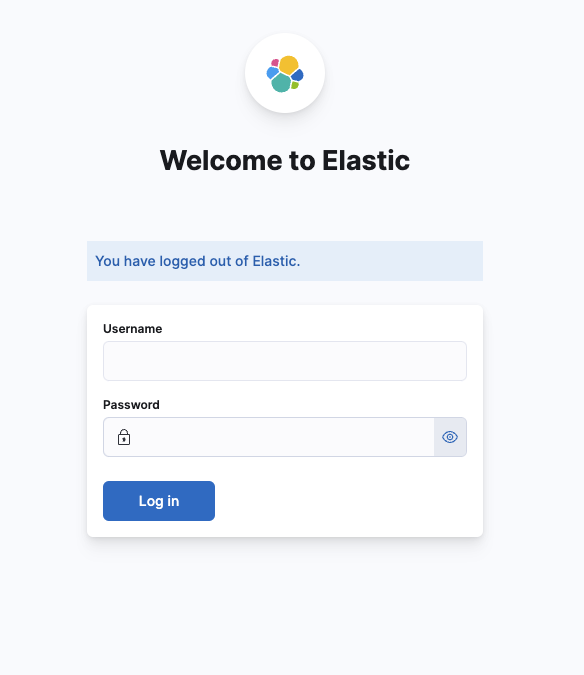
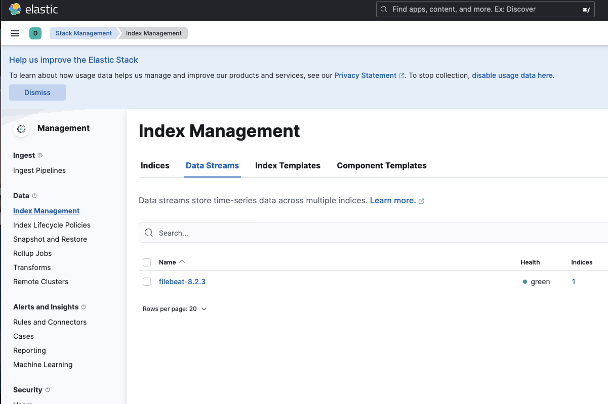
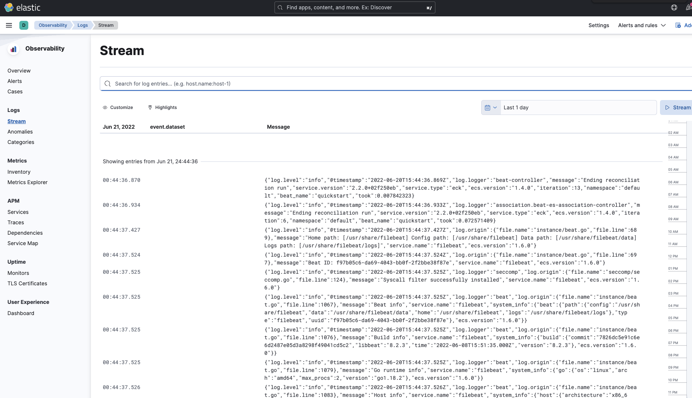

# K8S Logging #
이번 테스트는 k8s에서 Elasticsearch Operator를 사용하여 ElasticSearch를 설치하고 filebeat를 DaemonSet으로 설치하여 K8S Pod Log를 수집하여 확인할 수 있는 구성을 진행 합니다.


# *테스트만 진행된 경우로 실제 환경에서 사용할려면 많은 테스트가 필요함을 명시합니다.* #

Elasticsearch Operator는 Elasticsearch에서 공식적으로 지원하는 파일를 이용하여 설치 합니다.

---

## Deploy Elasticsearch Operator ##

manifest 자료는 files에 있지만 공식 사이트 가이드에 나오는 방식으로 진행하도록 하겠습니다.

### Deploy Elasticsearch CRD ###

Custom Resources Definition(CRD)를 배포하겠습니다.

`kubectl create -f https://download.elastic.co/downloads/eck/2.2.0/crds.yaml`

```
// Output is similar to:
customresourcedefinition.apiextensions.k8s.io/agents.agent.k8s.elastic.co created
customresourcedefinition.apiextensions.k8s.io/apmservers.apm.k8s.elastic.co created
customresourcedefinition.apiextensions.k8s.io/beats.beat.k8s.elastic.co created
customresourcedefinition.apiextensions.k8s.io/elasticmapsservers.maps.k8s.elastic.co created
customresourcedefinition.apiextensions.k8s.io/elasticsearches.elasticsearch.k8s.elastic.co created
customresourcedefinition.apiextensions.k8s.io/enterprisesearches.enterprisesearch.k8s.elastic.co created
customresourcedefinition.apiextensions.k8s.io/kibanas.kibana.k8s.elastic.co created
```

### Deploy Elasticsearch Operator ###

Elasticsearch Operator를 배포하겠습니다.

`kubectl apply -f https://download.elastic.co/downloads/eck/2.2.0/operator.yaml`

```
// Output is similar to:
namespace/elastic-system created
serviceaccount/elastic-operator created
secret/elastic-webhook-server-cert created
configmap/elastic-operator created
clusterrole.rbac.authorization.k8s.io/elastic-operator created
clusterrole.rbac.authorization.k8s.io/elastic-operator-view created
clusterrole.rbac.authorization.k8s.io/elastic-operator-edit created
clusterrolebinding.rbac.authorization.k8s.io/elastic-operator created
service/elastic-webhook-server created
statefulset.apps/elastic-operator created
validatingwebhookconfiguration.admissionregistration.k8s.io/elastic-webhook.k8s.elastic.co created
```

### Verify Elasticsearch Operator ###

Elasticsearch Operator가 제대로 배포 되었는지 확인합니다.

`kubectl get sts -n elastic-system`

```
// Output is similar to:
NAME               READY   AGE
elastic-operator   1/1     2m13s
```

`kubectl get pods -n elastic-system`

```
NAME                 READY   STATUS    RESTARTS   AGE
elastic-operator-0   1/1     Running   0          2m42s
```

---

## Deploy Elasticsearch ##

이번에는 검색엔진인 Elasticsearch를 배포하겠습니다.

### Create Elasticsearch Yaml ###

Elasticsearch를 배포하기 위한 yaml 파일을 생성하도록 하겠습니다.

```
cat > default-elasticserach.yaml <<EOF 
apiVersion: elasticsearch.k8s.elastic.co/v1
kind: Elasticsearch
metadata:
  name: quickstart
spec:
  version: 8.2.3
  nodeSets:
  - name: default
    count: 1
    config:
      node.store.allow_mmap: false
EOF
```

### Deploy Elasticsearch ###

Elasticsearch를 배포하겠습니다.

`kubectl apply -f default-elasticsearch.yaml`


```
// Output is similar to:
elasticsearch.elasticsearch.k8s.elastic.co/quickstart created
```

`kubectl get pods --watch`

```
// Output is similar to:
NAME                      READY   STATUS     RESTARTS   AGE
quickstart-es-default-0   0/1     Init:0/2   0          32s
quickstart-es-default-0   0/1     Init:0/2   0          48s
quickstart-es-default-0   0/1     Init:0/2   0          48s
quickstart-es-default-0   0/1     Init:0/2   0          48s
quickstart-es-default-0   0/1     Init:1/2   0          62s
quickstart-es-default-0   0/1     PodInitializing   0          63s
quickstart-es-default-0   0/1     Running           0          64s
quickstart-es-default-0   1/1     Running           0          86s
```

### Verify Elasticsearch ###

`kubectl get elasticsearch`

```
// Output is similar to:
NAME         HEALTH   NODES   VERSION   PHASE   AGE
quickstart   green    1       8.2.3     Ready   2m17s
```

`kubectl get service`

```
// Output is similar to:
NAME                          TYPE        CLUSTER-IP     EXTERNAL-IP   PORT(S)    AGE
kubernetes                    ClusterIP   10.200.1.1     <none>        443/TCP    25m
quickstart-es-default         ClusterIP   None           <none>        9200/TCP   3m23s
quickstart-es-http            ClusterIP   10.200.1.221   <none>        9200/TCP   3m24s
quickstart-es-internal-http   ClusterIP   10.200.1.235   <none>        9200/TCP   3m24s
quickstart-es-transport       ClusterIP   None           <none>        9300/TCP   3m24s
```

Elasticsearch에 API를 보내기 위해 password 정보를 확인합니다.
```
PASSWORD=$(kubectl get secret quickstart-es-elastic-user -o go-template='{{.data.elastic | base64decode}}')
ELASTICSEARCH=$(kubectl get service quickstart-es-http -o jsonpath='{.spec.clusterIP}')
```

Elasticsearch API로 정보 확인
`curl -u "elastic:$PASSWORD" -k "https://$ELASTICSEARCH:9200"`

```
// Output is similar to:
{
  "name" : "quickstart-es-default-0",
  "cluster_name" : "quickstart",
  "cluster_uuid" : "0y1K_9AJRMGqGqMiDFrJqA",
  "version" : {
    "number" : "8.2.3",
    "build_flavor" : "default",
    "build_type" : "docker",
    "build_hash" : "9905bfb62a3f0b044948376b4f607f70a8a151b4",
    "build_date" : "2022-06-08T22:21:36.455508792Z",
    "build_snapshot" : false,
    "lucene_version" : "9.1.0",
    "minimum_wire_compatibility_version" : "7.17.0",
    "minimum_index_compatibility_version" : "7.0.0"
  },
  "tagline" : "You Know, for Search"
}
```

---

## Deploy Elasticsearch Cluster ##

위와 같이 한개의 Elasticsearch만으로는 프로덕션용으로 사용하지는 않습니다.

Elasticsearch를 Cluster 구조로 배포하여 사용합니다. 다만 테스트 환경이 Worker node가 3개인 관계로 master 1, data 2개로 배포를 진행합니다.
실 서비스에서 쓰실 거라면 Worker node 6개로 하여 Master 3, Data 3으로 배포하시길 바랍니다.

### Create Production Elasticsearch ###

```
cat > prod-elasticserach.yaml <<EOF 
apiVersion: elasticsearch.k8s.elastic.co/v1
kind: Elasticsearch
metadata:
  name: quickstart
spec:
  version: 8.2.3
  nodeSets:
  - name: master-node
    count: 1
    config:
      node.roles: ["master"]
    podTemplate:
      spec:
        initContainers:
        - name: systctl
          securityContext:
            privileged: true
            runAsUser: 0
          command: ['sh', '-c', 'sysctl -w vm.max_map_count=262144']
  - name: data-node
    count: 2
    config:
      node.roles: ["data"]
    podTemplate:
      spec:
        initContainers:
        - name: systctl
          securityContext:
            privileged: true
            runAsUser: 0
          command: ['sh', '-c', 'sysctl -w vm.max_map_count=262144']
EOF
```

### Deploy Elsaticsearch Cluster ###

Elasticsearch Cluster를 배포하기 전에 기존에 배포한 Elasticsearch를 삭제하겠습니다.

`kubectl delete -f default-elasticsearch.yaml`


Elasticsearch Cluster를 배포하도록 하겠습니다.

`kubectl apply -f prod-elasticserach.yaml`

```
// Output is similar to:
elasticsearch.elasticsearch.k8s.elastic.co/quickstart configured
```

`kubectl get pods --watch`

```
// Output is similar to:
NAME                          READY   STATUS    RESTARTS   AGE
quickstart-es-data-node-0     0/1     Pending   0          2s
quickstart-es-data-node-1     0/1     Pending   0          2s
quickstart-es-master-node-0   0/1     Pending   0          2s
quickstart-es-data-node-0     0/1     Pending   0          4s
quickstart-es-data-node-0     0/1     Init:0/3   0          4s
quickstart-es-data-node-0     0/1     Init:0/3   0          5s
quickstart-es-data-node-1     0/1     Pending    0          5s
quickstart-es-data-node-1     0/1     Init:0/3   0          5s
quickstart-es-master-node-0   0/1     Pending    0          5s
quickstart-es-data-node-0     0/1     Init:0/3   0          6s
quickstart-es-data-node-1     0/1     Init:0/3   0          6s
quickstart-es-master-node-0   0/1     Init:0/3   0          6s
quickstart-es-data-node-1     0/1     Init:0/3   0          6s
quickstart-es-data-node-0     0/1     Init:0/3   0          7s
quickstart-es-data-node-1     0/1     Init:0/3   0          7s
quickstart-es-data-node-0     0/1     Init:1/3   0          7s
quickstart-es-master-node-0   0/1     Init:0/3   0          7s
quickstart-es-master-node-0   0/1     Init:0/3   0          8s
quickstart-es-data-node-0     0/1     Init:2/3   0          8s
quickstart-es-master-node-0   0/1     Init:0/3   0          8s
quickstart-es-data-node-0     0/1     Init:2/3   0          8s
quickstart-es-data-node-1     0/1     Init:0/3   0          8s
quickstart-es-data-node-1     0/1     Init:1/3   0          8s
quickstart-es-data-node-0     0/1     PodInitializing   0          9s
quickstart-es-master-node-0   0/1     Init:1/3          0          9s
quickstart-es-data-node-1     0/1     Init:2/3          0          9s
quickstart-es-data-node-0     0/1     Running           0          10s
quickstart-es-master-node-0   0/1     Init:2/3          0          10s
quickstart-es-data-node-1     0/1     PodInitializing   0          10s
quickstart-es-master-node-0   0/1     PodInitializing   0          11s
quickstart-es-data-node-1     0/1     Running           0          11s
quickstart-es-master-node-0   0/1     Running           0          12s
quickstart-es-master-node-0   1/1     Running           0          36s
quickstart-es-data-node-0     1/1     Running           0          39s
quickstart-es-data-node-1     1/1     Running           0          40s
```

`kubectl get elasticsearch`

```
// Output is similar to:
NAME         HEALTH   NODES   VERSION   PHASE   AGE
quickstart   green    3       8.2.3     Ready   73s
```

`kubectl get service`

```
// Output is similar to:
NAME                          TYPE        CLUSTER-IP     EXTERNAL-IP   PORT(S)    AGE
kubernetes                    ClusterIP   10.200.1.1     <none>        443/TCP    74m
quickstart-es-data-node       ClusterIP   None           <none>        9200/TCP   112s
quickstart-es-http            ClusterIP   10.200.1.122   <none>        9200/TCP   114s
quickstart-es-internal-http   ClusterIP   10.200.1.70    <none>        9200/TCP   114s
quickstart-es-master-node     ClusterIP   None           <none>        9200/TCP   112s
quickstart-es-transport       ClusterIP   None           <none>        9300/TCP   114s
```

Elasticsearch에 API를 보내기 위해 password 정보를 확인합니다.
```
PASSWORD=$(kubectl get secret quickstart-es-elastic-user -o go-template='{{.data.elastic | base64decode}}')
ELASTICSEARCH=$(kubectl get service quickstart-es-http -o jsonpath='{.spec.clusterIP}')
```

Elasticsearch API로 정보 확인
`curl -u "elastic:$PASSWORD" -k "https://$ELASTICSEARCH:9200"`

```
// Output is similar to:
{
  "name" : "quickstart-es-data-node-0",
  "cluster_name" : "quickstart",
  "cluster_uuid" : "btutqrb8RPKBhpVyhqapHA",
  "version" : {
    "number" : "8.2.3",
    "build_flavor" : "default",
    "build_type" : "docker",
    "build_hash" : "9905bfb62a3f0b044948376b4f607f70a8a151b4",
    "build_date" : "2022-06-08T22:21:36.455508792Z",
    "build_snapshot" : false,
    "lucene_version" : "9.1.0",
    "minimum_wire_compatibility_version" : "7.17.0",
    "minimum_index_compatibility_version" : "7.0.0"
  },
  "tagline" : "You Know, for Search"
}
```

Elasticsearch Cluster를 API로 정보 확인

`curl -u "elastic:$PASSWORD" -k "https://$ELASTICSEARCH:9200/_cluster/health?pretty"`

```
// Output is similar to:
{
  "cluster_name" : "quickstart",
  "status" : "green",
  "timed_out" : false,
  "number_of_nodes" : 3,
  "number_of_data_nodes" : 2,
  "active_primary_shards" : 1,
  "active_shards" : 2,
  "relocating_shards" : 0,
  "initializing_shards" : 0,
  "unassigned_shards" : 0,
  "delayed_unassigned_shards" : 0,
  "number_of_pending_tasks" : 0,
  "number_of_in_flight_fetch" : 0,
  "task_max_waiting_in_queue_millis" : 0,
  "active_shards_percent_as_number" : 100.0
}
```

### Create Index ###

Shard 3개와 Replica 3개를 설정한 Index를 생성하겠습니다.

```
curl -X PUT -u "elastic:$PASSWORD" -k "https://$ELASTICSEARCH:9200/doik?pretty" -H 'Content-Type: application/json' -d'
{
    "settings" : {
      "index.number_of_shards": 2,
      "index.number_of_replicas": 1
    }
 }
'
```

```
// Output is similar to:
{
  "acknowledged" : true,
  "shards_acknowledged" : true,
  "index" : "doik"
 }
```

### Check Index Setting ###

`curl -s -u "elastic:$PASSWORD" -k "https://$ELASTICSEARCH:9200/doik/_settings?pretty" | grep "number_of"`

```
// Output is similar to:
"number_of_shards" : "2",
"number_of_replicas" : "1",
```

### Check Index Shard ###

`curl -s -u "elastic:$PASSWORD" -k "https://$ELASTICSEARCH:9200/_cat/shards/_all?pretty"`

```
doik 0 p STARTED 0 225b 172.16.1.16 quickstart-es-data-node-1
doik 0 r STARTED 0 225b 172.16.2.17 quickstart-es-data-node-0
doik 1 r STARTED 0 225b 172.16.1.16 quickstart-es-data-node-1
doik 1 p STARTED 0 225b 172.16.2.17 quickstart-es-data-node-0
```

---

## Deploy kibana ##

Elasticsearch를 편안하게 GUI로 확인할 수 있는 kibana를 배포하겠습니다.

### Create kibana Yaml ###

Kibana를 배포하기 위한 yaml 파일을 생성하도록 하겠습니다.

```
cat > kibana.yaml <<EOF 
apiVersion: kibana.k8s.elastic.co/v1
kind: Kibana
metadata:
  name: quickstart
spec:
  version: 8.2.3
  count: 1
  elasticsearchRef:
    name: quickstart
EOF
```

### Deploy Kibana ###

Kibana를 배포하겠습니다.

`kubectl apply -f kibana.yaml`

```
// Output is similar to:
kibana.kibana.k8s.elastic.co/quickstart created
```

`kubectl get pods --watch`

```
// Output is similar to:
NAME                             READY   STATUS     RESTARTS   AGE
quickstart-es-default-0          1/1     Running    0          10m
quickstart-kb-84f88f45c9-skrnm   0/1     Init:0/1   0          3s
quickstart-kb-84f88f45c9-skrnm   0/1     Init:0/1   0          28s
quickstart-kb-84f88f45c9-skrnm   0/1     PodInitializing   0          31s
quickstart-kb-84f88f45c9-skrnm   0/1     Running           0          32s
quickstart-kb-84f88f45c9-skrnm   1/1     Running           0          50s
```

### Verify Kibana ###

`kubectl get kibana`

```
// Output is similar to:
NAME         HEALTH   NODES   VERSION   AGE
quickstart   green    1       8.2.3     2m11s
```

`kubectl get pods`

```
// Output is similar to:
NAME                             READY   STATUS    RESTARTS   AGE
quickstart-es-default-0          1/1     Running   0          12m
quickstart-kb-84f88f45c9-skrnm   1/1     Running   0          118s
```

`kubectl get service`

```
// Output is similar to:
NAME                          TYPE        CLUSTER-IP     EXTERNAL-IP   PORT(S)    AGE
kubernetes                    ClusterIP   10.200.1.1     <none>        443/TCP    36m
quickstart-es-default         ClusterIP   None           <none>        9200/TCP   14m
quickstart-es-http            ClusterIP   10.200.1.221   <none>        9200/TCP   14m
quickstart-es-internal-http   ClusterIP   10.200.1.235   <none>        9200/TCP   14m
quickstart-es-transport       ClusterIP   None           <none>        9300/TCP   14m
quickstart-kb-http            ClusterIP   10.200.1.113   <none>        5601/TCP   3m11s
```

Kibana에 접속하기 위해 우선 `elastic` 계정의 비밀번호를 확인합니다.

`kubectl get secret quickstart-es-elastic-user -o=jsonpath='{.data.elastic}' | base64 --decode; echo`

```
// Output is similar to:
784g899LKX2zMkxq3om1Dti6
```

Kibana에 접속하기 위해 `service/quickstart-kb-http`를 port-forward 합니다.

`kubectl port-forward --address 0.0.0.0 service/quickstart-kb-http 5601`

이제 자신의 Browser에서 https://<node ip>:5601로 접속을 하면 다음과 같은 화면을 볼 수 있게 됩니다.



위에서 확인한 `elastic` 계정의 비밀번호로 접속을 하면 kibana에 접속을 하실 수 있습니다.


이로써 Elasticsearch 와 Kibana의 배포가 완료 되었습니다.

---

## Deploy Filebeat ##

이제 Pod들의 Log를 수집하기 위해 Filebeat를 배포하도록 하겠습니다.

### Create Filebeat Yaml ###

```
cat > filebeat.yaml << EOF
apiVersion: beat.k8s.elastic.co/v1beta1
kind: Beat
metadata:
  name: quickstart
spec:
  type: filebeat
  version: 8.2.3
  elasticsearchRef:
    name: quickstart
  config:
    filebeat.inputs:
    - type: container
      paths:
      - /var/log/containers/*.log
  daemonSet:
    podTemplate:
      spec:
        dnsPolicy: ClusterFirstWithHostNet
        hostNetwork: true
        securityContext:
          runAsUser: 0
        containers:
        - name: filebeat
          volumeMounts:
          - name: varlogcontainers
            mountPath: /var/log/containers
          - name: varlogpods
            mountPath: /var/log/pods
          - name: varlibdockercontainers
            mountPath: /var/lib/docker/containers
        volumes:
        - name: varlogcontainers
          hostPath:
            path: /var/log/containers
        - name: varlogpods
          hostPath:
            path: /var/log/pods
        - name: varlibdockercontainers
          hostPath:
            path: /var/lib/docker/containers
EOF
```

### Deploy Filebeat ###

이제 Filebeat를 배포하겠습니다.
Filebeat는 모든 Node에 배포되어야 하기에 Deamonset으로 배포됩니다.

`kubectl apply -f filebeat.yaml`

```
// Output is similar to:
beat.beat.k8s.elastic.co/quickstart created
```

`kubectl get pods --watch`

```
// Output is similar to:
NAME                             READY   STATUS              RESTARTS   AGE
quickstart-beat-filebeat-fqcjm   0/1     ContainerCreating   0          3s
quickstart-beat-filebeat-j54gj   0/1     ContainerCreating   0          3s
quickstart-beat-filebeat-pw2lp   0/1     ContainerCreating   0          3s
...
quickstart-beat-filebeat-j54gj   1/1     Running             0          15s
quickstart-beat-filebeat-pw2lp   1/1     Running             0          17s
quickstart-beat-filebeat-fqcjm   1/1     Running             0          20s
```

### Verify Filebeat ###

`kubectl get beat`

```
// Output is similar to:
NAME         HEALTH   AVAILABLE   EXPECTED   TYPE       VERSION   AGE
quickstart   green    3           3          filebeat   8.2.3     2m4s
```

`kubectl get pods`

```
// Output is similar to:
NAME                             READY   STATUS    RESTARTS   AGE
quickstart-beat-filebeat-fqcjm   1/1     Running   0          2m12s
quickstart-beat-filebeat-j54gj   1/1     Running   0          2m12s
quickstart-beat-filebeat-pw2lp   1/1     Running   0          2m12s
```

`kubectl get daemonset`

```
// Output is similar to:
NAME                       DESIRED   CURRENT   READY   UP-TO-DATE   AVAILABLE   NODE SELECTOR   AGE
quickstart-beat-filebeat   3         3         3       3            3           <none>          2m27s
```

Elasticsearch에 Log가 저장되는지 확인

`curl -u "elastic:$PASSWORD" -k "https://$ELASTICSEARCH:9200/filebeat-*/_search"`

```
// Output is similar to:
{"took":5,"timed_out":false,"_shards":{"total":1,"successful":1,"skipped":0,"failed":0},"hits":{"total":{"value":5791,"relation":"eq"},"max_score":1.0,"hits":[{"_index":".ds-filebeat-8.2.3-2022.06.20-000001","_id":"w5nMgYEB93mgnhjOc-q2","_score":1.0,"_source":{"@timestamp":"2022-06-20T15:47:41.029Z","log":{"offset":26361,"file":{"path":"/var/log/containers/quickstart-beat-filebeat-fqcjm_default_filebeat-0d6fc23824b0c6d18268be724dc91dec4fba97c50dd7a79e00f27ddb261ff648.log"}},"stream":"stderr","message":"{\"log.level\":\"info\",\"@timestamp\":\"2022-06-20T15:47:41.029Z\",\"log.logger\":\"monitoring\",\"log.origin\":{\"file.name\":\"log/log.go\",\"file.line\":184},\"message\":\"Non-zero metrics in the last 30s\",\"service.name\":\"filebeat\",\"monitoring\":{\"metrics\":{\"beat\":{\"cgroup\":{\"cpu\":{\"stats\":{\"periods\":17}},\"memory\":{\"mem\":{\"usage\":{\"bytes\":8192}}}},\"cpu\":{\"system\":{\"ticks\":170,\"time\":{\"ms\":10}},\"total\":{\"ticks\":2420,\"time\":{\"ms\":20},\"value\":0},\"user\":{\"ticks\":2250,\"time\":{\"ms\":10}}},\"handles\":{\"limit\":{\"hard\":1048576,\"soft\":1048576},\"open\":20},\"info\":{\"ephemeral_id\":\"8d352398-0105-4bad-b446-38e12f698091\",\"uptime\":{\"ms\":181107},\"version\":\"8.2.3\"},\"memstats\":{\"gc_next\":26328152,\"memory_alloc\":13701592,\"memory_total\":367649808,\"rss\":117317632},\"runtime\":{\"goroutines\":77}},\"filebeat\":{\"events\":{\"added\":1,\"done\":1},\"harvester\":{\"open_files\":10,\"running\":10}},\"libbeat\":{\"config\":{\"module\":{\"running\":0}},\"output\":{\"events\":{\"acked\":1,\"active\":0,\"batches\":1,\"total\":1},\"read\":{\"bytes\":358},\"write\":{\"bytes\":2510}},\"pipeline\":{\"clients\":1,\"events\":{\"active\":0,\"published\":1,\"total\":1},\"queue\":{\"acked\":1}}},\"registrar\":{\"states\":{\"current\":10,\"update\":1},\"writes\":{\"success\":1,\"total\":1}},\"system\":{\"load\":{\"1\":0.06,\"15\":0.32,\"5\":0.28,\"norm\":{\"1\":0.03,\"15\":0.16,\"5\":0.14}}}},\"ecs.version\":\"1.6.0\"}}","input":{"type":"container"},"ecs":{"version":"8.0.0"},"host":
...
```

Kibana에서 확인
`Stack MAnagement -> Index Management -> Data Streams`



`Observability -> Logs -> Stream`




# 참조 사이트 #
1. [Elasticsearch](https://www.elastic.co/kr/downloads/elastic-cloud-kubernetes)